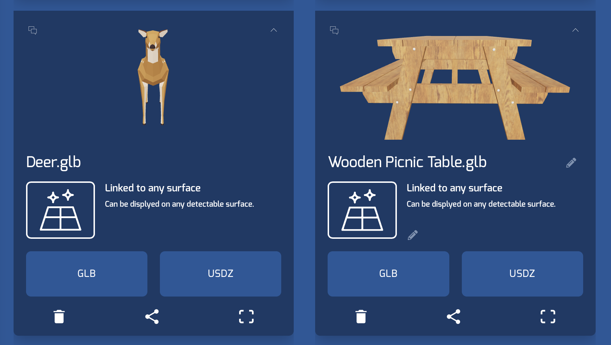
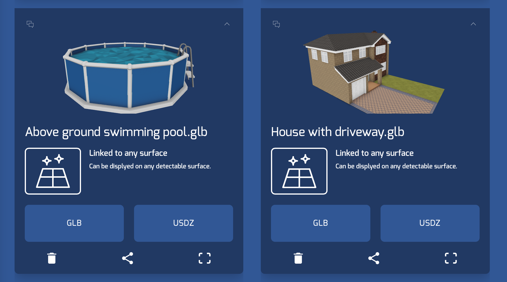
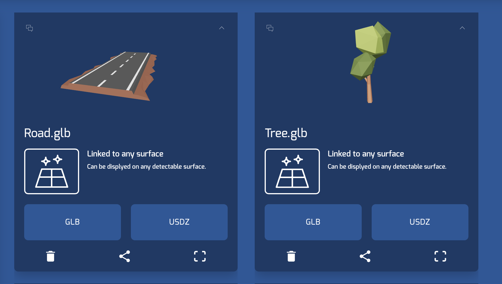

# iOS-ARKit-demo-Town-Builder
ARTownBuilderDemo is a tabletop augmented reality iOS demo app, built with the echoAR Swift SDK, that allows users
to build virtual neighborhoods on horizontal surfaces. 

## Register
Don't have an API key? Make sure to register for FREE at [echoAR](https://console.echoar.xyz/#/auth/register)

## Build and Run
1. Make sure you have Xcode downloaded
2. clone this repository
3. open ARTownBuilderDemo.xcodeproj using Xcode 
(if you have Xcode downloaded you simply double click the file to open)
4. Go to the "Signing&Capabilities" tab on Xcode and fill out your signing
information. See more details [here](https://docs.echoar.xyz/swift/adding-ar-capabilities) 
6. Go to the EchoAR.swift file, insert your api key as a String where it says "insert api key here"
7. Go to the echoAR console and add the 3d content you would like to use in the scene (see below for the optimal choices for the demo). 
7. Go to the ViewController.swift file, add the entry id's for 3d content you have added to your echoAR console. Where it says
"insert entry id here"
5. Connect your iPhone to your computer.
6. Select your iPhone on the dropdown list of devices to run the demo app on. 
7. Press the play button to build an run (Note: your device must be unlocked to run)

## Using The Demo
1. Move your phone around a horizontal surface to scan a plane.
2. If the "Add" button is selected, choose an object to add, and touch somewhere on your horizontal plane to add it.
3. If any other edit buttons are selected (Drag, Rotate, or Delete). Tap or drag on the object you would like to edit.
4. Objects can be scaled at any time by doing the two finger pinch gesture on them.

## Learn More
Refer to our [documentation](https://docs.echoar.xyz/swift/installation) to learn more about echoAR and the swift SDK. 

## Support 
Feel free to reach out at <support@echoAR.xyz> or join our [support channel on Slack](https://join.slack.com/t/echoar/shared_invite/enQtNTg4NjI5NjM3OTc1LWU1M2M2MTNlNTM3NGY1YTUxYmY3ZDNjNTc3YjA5M2QyNGZiOTgzMjVmZWZmZmFjNGJjYTcxZjhhNzk3YjNhNjE).

## Screenshots

## Additional Notes
1. Currently the iPhone 4s and the first generation iPhoneSE screens are too small for the demo.
    * All other screen sizes (larger than the above) can run the demo 
2. Users can drag nodes to be buried underneath the horizontal plane. Because dragging the horizontal plane
itself is not allowed in the demo, this then gets the node stuck underneath the plane.
    * Depending on use case, this can be solved by allowing the editing of the horizontal plane (see the isPlane() function)
    * Note: toggling the horizontal plane toggles visibility, but the plane node is still in the scene.

### Images of the default entries for the demo

Demo created by [Daye Jack](https://github.com/ddj231/).